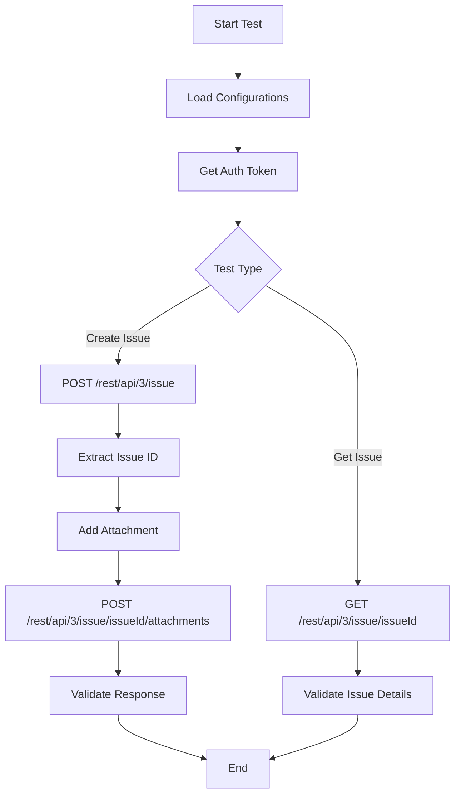

# Jira API Automation Framework

This project provides a robust framework for automating Jira API testing using Java, RestAssured, and TestNG. It demonstrates best practices in configuration management, secure credential handling, and modular test design.

---

## 📦 Project Structure

```
Jira_Bug/
├── src/
│   ├── main/
│   │   ├── java/
│   │   │   └── com/api/automation/
│   │   │       ├── config/    # Configuration management (ConfigManager)
│   │   │       ├── models/    # Data models (User, Post)
│   │   │       ├── pages/     # (empty, for future page objects)
│   │   │       └── utils/     # (empty, for future utilities)
│   │   └── resources/
│   │       ├── config.properties         # Non-sensitive config
│   │       ├── secrets.properties       # Sensitive data (gitignored)
│   │       └── secrets.properties.example # Example for setup
│   └── test/
│       └── java/
│           └── com/api/automation/
│               └── tests/     # Test classes (createIssue, getIssue)
├── .gitignore
├── pom.xml
├── README.md
└── testng.xml
```

---

## 🏗️ Architecture Overview

- **ConfigManager**: Singleton class that loads configuration and secrets from properties files.
- **Models**: Java POJOs for API payloads and responses (e.g., `User`, `Post`).
- **Tests**: Contains test classes for different Jira API operations (e.g., create issue, get issue).
- **Secure Credentials**: All sensitive data is loaded from `secrets.properties` (excluded from git).

---

## 🔄 Test Flow Diagram




---

## 🚀 Example Test Flows

### Create Issue
1. Load configuration and secrets
2. Set Jira base URI and auth token
3. Send POST request to create a new issue
4. Extract issue ID from response
5. Add attachment to the created issue
6. Validate response status and log details

### Get Issue
1. Load configuration and secrets
2. Set Jira base URI and auth token
3. Send GET request for a specific issue
4. Validate response and log details

---

## 🛡️ Security Best Practices
- **No hardcoded credentials**: All secrets are loaded from a gitignored file
- **Example secrets file**: Provided for easy onboarding
- **.gitignore**: Excludes all sensitive and build files

---

## 💡 How to Use

1. Copy `secrets.properties.example` to `secrets.properties` and fill in your Jira API token
2. Update `config.properties` with your Jira instance URL
3. Run tests using Maven:
   ```bash
   mvn clean test
   ```

---

## 📝 For Resume & Interview
- Demonstrates secure API automation practices
- Modular, extensible, and ready for CI/CD
- Easily adaptable for other REST APIs
- Clean separation of config, models, and tests
- Ready for integration with reporting tools (e.g., Allure)

---

## 📄 License
[Add your license here]
